# Sound Processing Basic

- Sound is a phenomenon that particle's vibration of the air
- The standard of vibration of the air called sound pressure
- Sound data is time series data of the sound pressure's transition

## Sine function

- sine function is a simplest form of sound data
  - amplitude : $A$
  - frequency : $\omega$
  - phase : $\phi$
- sine expression
  - $$ A \operatorname*{sin}(\omega t - \phi) $$
  - or
  - $$ A \operatorname*{sin}(2 \pi f t - \phi) $$
- Frequence is the number of occurrences of a repeating event per unit of time
  - $$ w = 2 \pi f $$
  - f = 1.0 Hz, T = 1.0 S

```python
import numpy as np
import matplotlib.pyplot as plt

t = np.linspace(0, 1, 100)

plt.plot(t, 1 * np.sin(2 * np.pi * t + 0), ls="-", label=r"$\sin\left(2\pi{t}\right)$ frequency 1 Hz. amplitude 1, phase 0")
plt.plot(t, 2 * np.sin(2 * np.pi * t + 0), ls="--", label=r"$2\sin\left(2\pi{t}\right)$ frequency 1 Hz. amplitude 1, phase 0")
plt.plot(t, 1 * np.sin(3 * np.pi * t + 0), ls=":", label=r"$\sin\left(3\pi{t}\right)$ frequency 1.5 Hz. amplitude 1, phase 0")
plt.plot(t, 1 * np.sin(2 * np.pi * t - 0.3), ls="-.", label=r"$\sin\left(2\pi{t}\right)$ frequency 1 Hz. amplitude 1, phase -0.3")
plt.ylim(-2.2, 3)
plt.xticks(np.linspace(0, 1, 5))
plt.legend()
plt.title(r"$A\sin\left(\omega{t}+\phi\right)$")
plt.show()
```
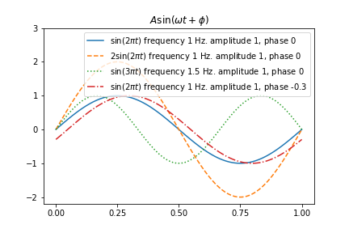

## The relation between frequency and period

- $\omega$ : frequency
- $T$ : period
- $$\omega = \frac{2\pi}{T}$$

## Single Tone

- Frequency is tone in human
  - tone == beep
  - ex) ring tone = 400Hz

```python
def single_tone(frequency, rate=44100, duration=1):
    t = np.linspace(0, duration, int(rate))
    y = np.sin(2 * np.pi * frequency * t)
    return y

y = single_tone(400)
from IPython.display import Audio, display
display(Audio(y, rate=44100))
# You cannot listion tone by your mac
```

- Middle C is 261.65 Hz single tone in the scale
- semitone (half tone, half step) $2^{\frac{1}{12}}$

```python
notes = 'C, C#, D, D#, E, F, F#, G, G#, A, A#, B, C'.split(',')
freqs = 220. * 2**(np.arange(3, 3 + len(notes)) / 12.)
notes = list(zip(notes, freqs))
notes
octave = np.hstack([single_tone(f) for f in freqs])
display(Audio(octave, rate=44100))
```

## Wave file format

- wave file is basic sound pressure time series file format which extension is .wav
- wave file usually measure 44100 sound pressure per second  and record as 2 bytes between -32768 ~ 32768 $(=2^{15})$
- In python, to read or write wave file use `read`, `write` command which io.wavfile provide subpakage of scipy package

```python
import scipy.io.wavfile
scipy.io.wavfile.write("octave.wav", 44100, octave)
#octave is exist above code

sr, y_read = scipy.io.wavfile.read("octave.wav")
plt.plot(y_read[:3000])
plt.show()

Audio(y_read, rate=sr)
```
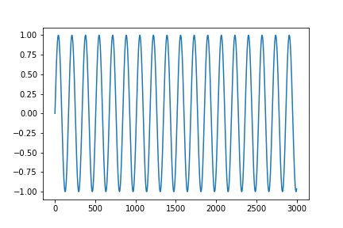

## Dual-tone multi-frequency signaling

- Telephone use the way DTMF(Dual-tone multi-frequency) sound signal the combination of two single-tone to receive telephone number
- DTMF is sin + sin

# Fourier Transform(FT) and spectrum

- Learn about the Fourier transform and spectrum, which are methods of extracting features from speech, music, and sound data

## Sine wave combination

- Signal can be represented by the combination of frequency, magnitude, phase and other sinusolida signal
- The Fourier transform is a method of separating the sinusoids that make up the signal from the combined signal

```python
N = 1024
T = 1.0 /44100.0
f1 = 697
f2 = 1209
t = np.linspace(0.0, N*T, N)
y1 = 1.1 * np.sin(2 * np.pi * f1 * t)
y2 = 0.9 * np.sin(2 * np.pi * f2 * t)
y = y1 + y2

plt.subplot(311)
plt.plot(t, y1)
plt.title(r"$1.1\cdot\sin(2\pi\cdot 697t)$")
plt.subplot(312)
plt.plot(t, y2)
plt.title(r"$0.9\cdot\sin(2\pi\cdot 1209t)$")
plt.subplot(313)
plt.plot(t, y)
plt.title(r"$1.1\cdot\sin(2\pi\cdot 697t) + 0.9\cdot\sin(2\pi\cdot 1209t)$")
plt.tight_layout()
plt.show()
```
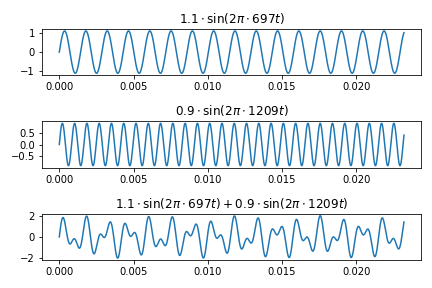


## Complex exponential function

- By Euler's formular, complex exponential function with imaginary number in exponential can be represented like below

$$ exp(i \cdot x) = \operatorname{cos}x + i \operatorname{sin}x $$

## Fourier Transform

- All cyclic function with period T can be represented below

$$
y(t) = \sum_{k= -\infty}^{\infty} A_{k} exp(i \cdot 2\pi \frac{k}{T}t)
$$

$$
A_{k} = \frac{1}{T} \int_{-\frac{T}{2}}^{\frac{T}{2}}f(t) exp(-i \cdot 2\pi \frac{k}{T}t)
$$

## Discrete Fourier Transform

- When there are time series data with legnth N

$$
y_0, y_1,...,y_{N-1}
$$

- DFT suppose repeat N and do FT
- In case, discrete time series data is represented below

$$
y_n = \frac{1}{N} \sum_{k=0}^{N-1}Y_k \cdot exp(i \cdot 2 \pi \frac{k}{N}n)
$$

$$
Y_k = \sum_{n=0}^{N-1} y_n \cdot exp(-i \cdot 2 \pi \frac{k}{N}n)
$$

## Fast Fourier Transform (FFT)

- Fast Fourier Transform is an algorithm for doing DFT with very little computation
- It can be applied in time series with length $2^N$
- Big O
  - DFT
    - $O(N^2)$
  - FFT
    - $O(N\log_{2}{N})$
- Gibbs phenonmenon : If the begining and end of time series is too diff, it could create signal which doesn't exist before

```python
y2 = np.hstack([y, y, y])

plt.subplot(211)
plt.plot(y2)
plt.axvspan(N, N * 2, alpha=0.3, color='green')
plt.xlim(0, 3 * N)

plt.subplot(212)
plt.plot(y2)
plt.axvspan(N, N * 2, alpha=0.3, color='green')
plt.xlim(900, 1270)

plt.show()
```
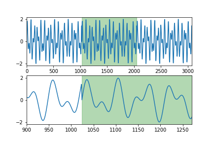

- Analysis above frequency with fftp command of scipy.fftpack emphasize 692Hz, 1211Hz
- periodgram

```python
from scipy.fftpack import fft

yf = fft(y, N)
xf = np.linspace(0.0, 1.0/(2.0*T), N//2)

plt.stem(xf, 2.0/N * np.abs(yf[0:N//2]))
plt.xlim(0, 3000)

plt.show()
```
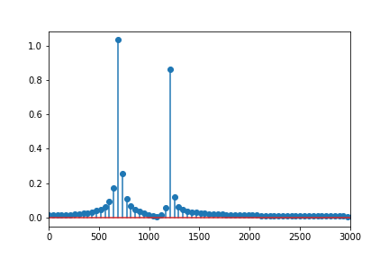

## Discrete Cosine Transform

- DCT is similar with DFT
- basis function is cosine function, not a complex exponential function
- Little computation than DFT and print $R$

$$
Y_k = \sum_{n=0}^{N-1}y_n \cdot cos(2\pi\frac{k}{N}(\frac{2n+1}{4}))
$$

```python
from scipy.fftpack import dct

dct_type = 2
yf2 = dct(y, dct_type, N)

plt.subplot(311)
plt.stem(np.real(yf))
plt.title("DFT real")

plt.subplot(312)
plt.stem(np.imag(yf))
plt.title("DFT complex")

plt.subplot(313)
plt.stem(np.abs(yf2))
plt.title("DCT")

plt.tight_layout()
plt.show()
```
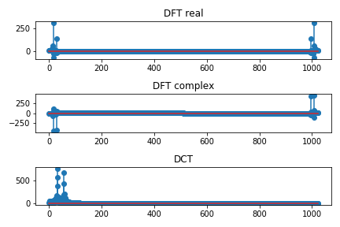

## Spectrum

- In time series analysis, spectrum is power spectrum or spectral density
- The Fourier transform is the transformation of the deterministic time series data into the frequency domain, while the spectrum is the transformation of the stochastic stochastic model into the frequency domain
- Unlike the Fourier transform, time-phase phase information does not appear in the spectrum
- One of the methods used to estimate the spectrum is to divide the entire time series into short intervals, and then window each interval to reduce the Gibbs phenomenon and average the values from the FFT calculation. Usually expressed in log scale

```python
import scipy.signal

f, P = scipy.signal.periodogram(y, 44100, nfft=2**12)

plt.subplot(211)
plt.plot(f, P)
plt.xlim(100, 1900)
plt.title("Linear scale")

plt.subplot(212)
plt.semilogy(f, P)
plt.xlim(100, 1900)
plt.ylim(1e-5, 1e-1)
plt.title("Log scale")

plt.tight_layout()
plt.show()
```
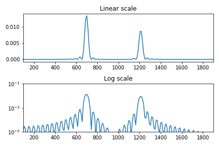

## STFT

- STFT is a method for analyzing sound whose frequency characteristics vary over time
- The data is obtained by dividing the time series into regular time intervals and obtaining the spectrum for each interval
- Represented as two-dimensional data of time-frequency

## librosa Package

- Use the librosa package for STFT spectrum analysis in Python
- When using the librosa package on Jupyter notebooks, set the iopub_data_rate_limit setting in the jupyter_notebook_config.py file to as large as 10000000

```python
import librosa
import librosa.display

D = np.abs(librosa.stft(y))
librosa.display.specshow(librosa.amplitude_to_db(D, ref=np.max), y_axis='linear', x_axis='time')
plt.title('Dual Tone')
plt.show()
```
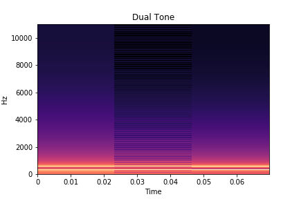

```python
sr_octave, y_octave = scipy.io.wavfile.read("octave.wav")

D_octave = np.abs(librosa.stft(y_octave))
librosa.display.specshow(librosa.amplitude_to_db(D_octave, ref=np.max), sr=sr_octave, y_axis='linear', x_axis='time')
plt.title('Octave')
plt.show()
```
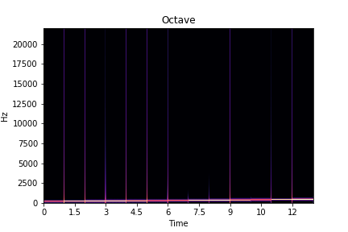

## Mel Spectrum

- Mel spectrum refers to a spectrum in which units of frequency are converted into mel units according to the following formula
- $$ m = 2595 \operatorname{log}_{10}( 1 + \frac{f}{700}) $$

```python
S_octave = librosa.feature.melspectrogram(y=y_octave, sr=sr_octave, n_mels=128)
librosa.display.specshow(librosa.power_to_db(S_octave, ref=np.max), sr=sr_octave, y_axis='mel', x_axis='time')
plt.show()
```
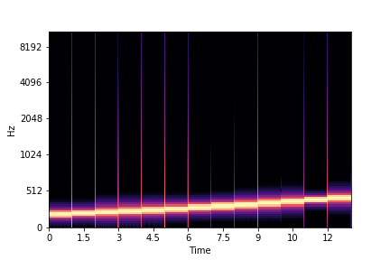

## MFCC

```python
y, sr = librosa.load(librosa.util.example_audio_file())

plt.plot(y[1000:5000])
plt.show()
```
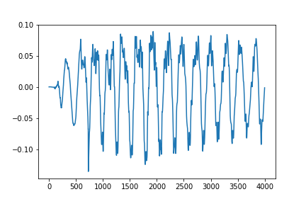

```python
from IPython.display import Audio, display
Audio(y, rate=sr)
```

```python
S = librosa.feature.melspectrogram(y=y, sr=sr, n_mels=128)
librosa.display.specshow(librosa.power_to_db(S, ref=np.max), sr=sr, y_axis='mel', x_axis='time')
plt.show()
```
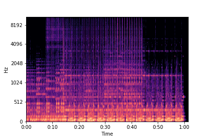

- Mel-frequency cepstral coefficients is a coefficient obtained by grouping Mel Scale Spectrum into 40 frequency bands and then Fourier transforming them
- It can be thought of as a characteristic value indicating how the spectrum is shaped

```python
mfccs = librosa.feature.mfcc(y=y, sr=sr, n_mfcc=40)
librosa.display.specshow(mfccs, x_axis='time')
plt.title('MFCC')
plt.tight_layout()
plt.show()
```
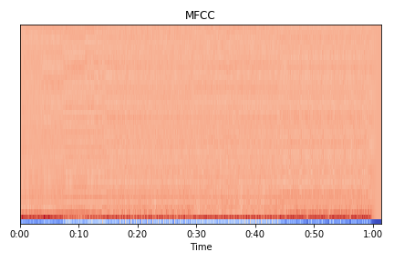
